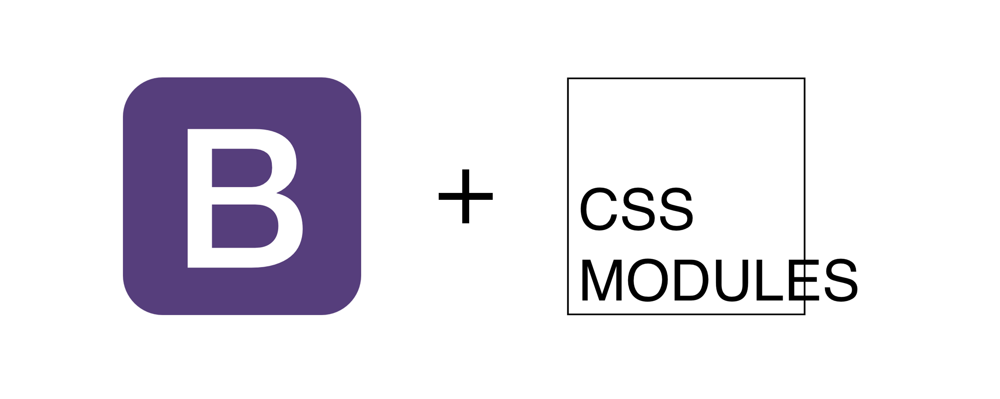

<p align="center">
    
</p>

<h1 align="center">Bootstrap CSS Modules</h1>

<p align="center"><b>Bootstrap made easy with CSS modules for modular, scoped styling in your web applications.</b></p>

<p align="center" style="align: center;">
    <a href="https://www.npmjs.com/package/@appzic/bootstrap-css-modules">
        
    </a>
    <a href="https://www.npmjs.com/package/@appzic/bootstrap-css-modules">
        
    </a>
    <a href="https://github.com/appzic/bootstrap-css-modules/blob/main/LICENSE">
        
    </a>
</p>

## Table of Contents

- [Table of Contents](#table-of-contents)
- [Introduction](#introduction)
- [Features](#features)
- [Installation](#installation)
- [Usage](#usage)
- [Contributing](#contributing)
- [License](#license)
- [Sponsors](#sponsors)

## Introduction

`@appzic/bootstrap-css-modules` integrates Bootstrap styles as CSS Modules, providing modular, scoped styling for your applications. It leverages the power of CSS Modules to encapsulate styles, preventing conflicts and promoting maintainability.

## Features

- Scoped styling using CSS Modules
- Utilizes Bootstrap's powerful grid system
- Modular and maintainable styles
- TypeScript support for type checking and improved development experience
- Encapsulation of CSS rules and styles to prevent conflicts
- Reusable styles across components for consistent designs
- Reduced duplicate code in your application
- Improved performance through unique class names generated at build time

## Installation

You can install Bootstrap CSS Modules using npm:

```bash
npm install @appzic/bootstrap-css-modules
```

## Usage

```jsx
import React from "react";
import bs from "@appzic/bootstrap-css-modules/dist/bootstrap-1.0.0.module.css";

const Component = () => {
	return (
		<div className={`${bs.row}`}>
			<div class={`${bs.span6} ${bs.columns}`}>...</div>
			<div class={`${bs.span10} ${bs.columns}`}>...</div>
		</div>
	);
};

export default Component;
```

## Contributing

We welcome contributions from the community! Please take a look at our [CONTRIBUTING.md](https://github.com/appzic/bootstrap-css-modules/blob/main/CONTRIBUTING.md) file for more information on how to get started. We appreciate all kinds of contributions, from bug reports and feature requests to code contributions and documentation improvements. Thank you for considering contributing to our project!

## License

Bootstrap CSS Modules is licensed under the [MIT](https://github.com/appzic/bootstrap-css-modules/blob/main/LICENSE) License.

## Sponsors

<p align="center" style="align: center;">
    <a href="https://appzic.com" style="margin-right: 10px">
        
    </a>
    <a href="https://vecpad.com">
        
    </a>
</p>